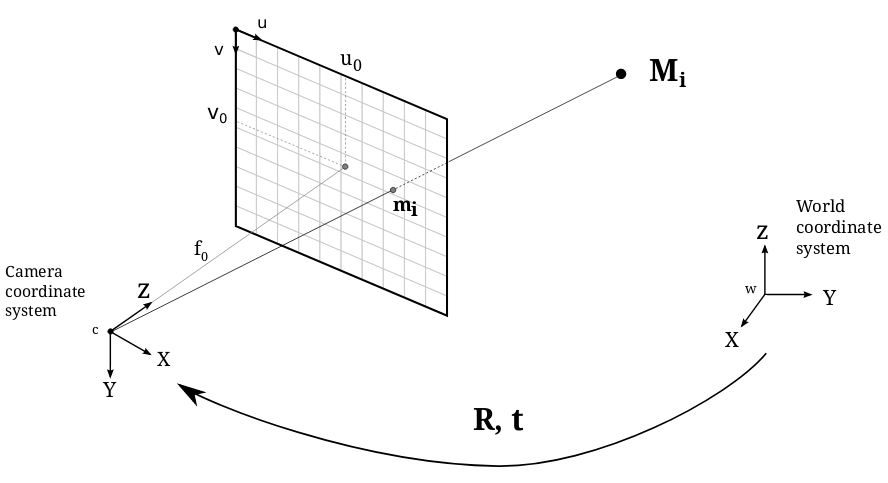
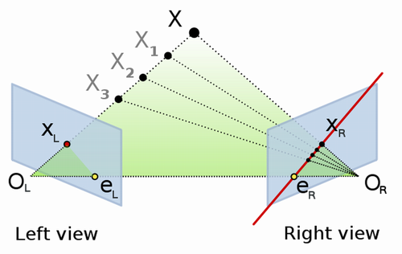
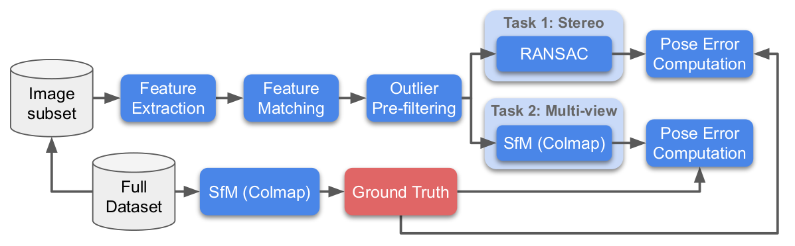

# Description

画像から三次元データを再構成する処理方法は Structure-from-Motion（SfM）と呼ばれている。
この手法の問題の一つとして、複数の画像の同一箇所が分からないということがある。
これはある特徴的な部分をベクトル量にして（local features）、それら同士を比較することで
対応付ける。

Google map などでもこのSfMは採用されている。

# Evaluation

# Problem definition

## projective geometery

実際のオブジェクトの座標 M を intrinsics matrix K を用いることで、写真平面に
射影することができる。
RM + T で実際に world systemから camera systemへ平行移動して、intrinsics matrix Kを
かけることで写真平面上に射影できる。

- Mi ：world coordinate system の三次元座標
- mi : image plane の二次元座標（u0, v0）
- f0：焦点距離
- R, T ：
  - rotation matrix R, translation vector T
  - 回転と並進操作を定義する3x3行列と3x1ベクトルで、$[R|T]$ はextrinsic matrixと呼ばれる
- K：calibration matrix/intrinsic matrix
  - 三次元のオブジェクトを写真平面に射影する行列（camera intrinsics）
- fundamental matrix F
  - 同じ風景の別の見え方同士の射影をカプセル化する行列
  - 風景には依存せず、カメラの内在・外部の情報にのみ依存する

学習データは K, R, T が与えられており、Fを予測するモデルを構築する。

### Rotation-translation matrix

回転と並進の操作は一つの行列として定義されることがある。
回転行列は：
$R = \left(
\begin{matrix}
\cos\theta & -\sin\theta \\
\sin\theta & \cos\theta
\end{matrix}
\right)
$

並進行列は：
$T = \left(
\begin{matrix}
x_0 \\
y_0
\end{matrix}
\right)
$
と表すことができ、これらを $3\times3$の行列に修正する。

$[R|T] = \left(
\begin{matrix}
\cos\theta & -\sin\theta & x_0 \\
\sin\theta & \cos\theta  & y_0 \\
0 & 0 & 1
\end{matrix}
\right)
$

ある座標 $(x, y)$を変換したいときには、$(x,y,1)$に修正してこの行列を作用させることで
回転と並進が同時に行えた座標を計算することができる。

### 変換式

以上より、三次元座標は

$m_i = K[R|T]M_i$

と変換される。

## Epipolar Geometry (エピポーラ幾何)

ステレオビジョンにおける2カメラ間での幾何学をエピポーラ幾何という。
カメラを使って撮影した画像は3D→2Dの次元になるため、各画素に対応する実際の点とカメラ間の距離が
分からなくなってしまう。ただし2台のカメラを用いることで可能になり、これをステレオビジョンという。

- 光学中心、投影中心：OL, OR
- epipole：
  - 他方のカメラの光学中心と画像平面の交点（eL, eR）
  - 他方のカメラが画角に写る位置のことで、物体の位置（X)とは無関係である
- epipolar plane:
  - 2つの光学中心と物体（OL,X,OR）の作る平面
- epiline：
  - 光学中心と画像平面の交点と、他方のカメラのepipoleとを結んだ直線(eR,XR)。epipolar planeと画像平面との交差線
  - 左のカメラでXLに写っているときに、右のカメラではどこに位置しているかの候補を示す線分（図中の赤線）
  - 左のカメラで物体が写る位置 $X_L$ が分かれば、右カメラにおける epiline は一意に決定することができる

このエピポーラ幾何は例えば、左カメラ上の点pに対応する点を右カメラ上の画像内で探索するときに使用される。
対応する点は右カメラのエピポーラ線上にあるので探索対象をその直線上にのみ限定することができる（エピポーラ線はじゃあどうやって見つけるのか？）。

### エピポーラ拘束

左カメラに写る位置 $X_L$ が分かれば、右カメラにおけるエピポーラ線を一意に決定することができる。
つまり右カメラから物体Xの位置を探すには、その epiline 上の点のみを探索すればよい。

### Fundamental matrix

2台のカメラ平面の座標 $m_i^\prime, m_i$ は以下の式を満たす

$
m_i^\prime F m_i = 0
$

このときの $F$ を fundamental matrixと呼ぶ。eight-point algorithm か openCV, Kornia で計算できる。

# Reference

- http://www.ail.cs.gunma-u.ac.jp/ailwiki/index.php?%E3%82%A8%E3%83%94%E3%83%9D%E3%83%BC%E3%83%A9%E6%8B%98%E6%9D%9F%E3%82%92%E7%94%A8%E3%81%84%E3%81%9F%E5%B0%8F%E6%83%91%E6%98%9F%E7%94%BB%E5%83%8F%E3%81%AE%E5%AF%BE%E5%BF%9C%E7%82%B9%E6%B1%BA%E5%AE%9A%E3%81%AB%E3%81%8A%E3%81%91%E3%82%8B%E7%B2%BE%E5%BA%A6%E5%90%91%E4%B8%8A%E6%89%8B%E6%B3%95

# LoFtr

# 戦略
## 古典的なパイプライン

- local features の計算
- local features のマッチング
- フィルタリング
- RANSAC の適用

# カメラ

camera には extrinsic と intrinsic のパラメータがある

## extrinsic

- 三次元座標
- world system に対するカメラの座標系

## intrinsics

- 焦点距離
- skew, distortion, scale
- principal offsets

# 手法まとめ

## RANSAC (Random Sample Consensus)

外れ値の影響を除いてモデルを学習する手法。学習データの subset を作成し、繰り返しモデルを学習することで
頑強なモデルを作成することができる。

## LoFTR

## SuperGlue

## OANet

## DISK
